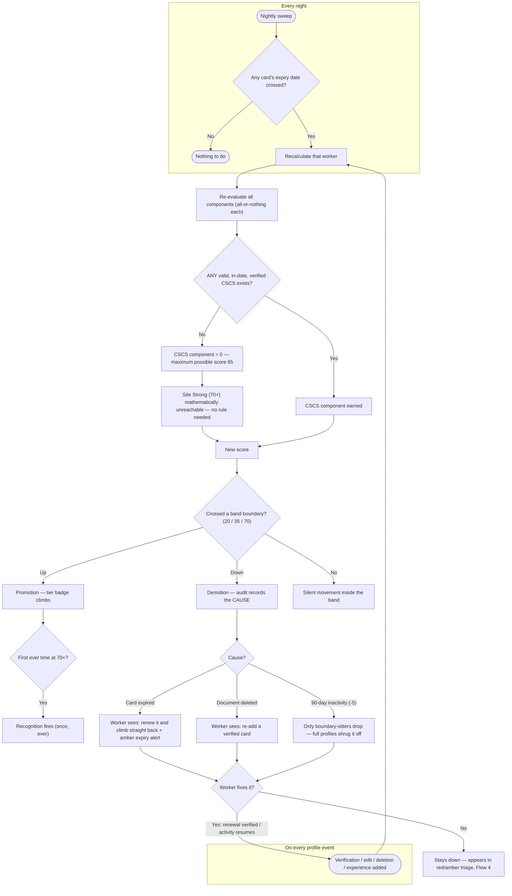

# 5. Worker profiles & tiers

A worker's profile is their complete record: identity, cards, experience, skills, compliance, and history. This chapter covers reading the profile — and understanding the tier system that summarises it.

## 5.1 The profile at a glance

Open any worker from the workers table. The header answers the first questions: photo and name, trade, **tier badge**, completeness gauge, current project assignment (editable in place), and a compliance pill with any issue count.

SCREENSHOT ch05-profile-header.png — Dharminder Singh's profile header; callouts: ① tier badge ② completeness gauge ③ project assignment ④ compliance pill

Below the header:

- **Cards & qualifications** — tiles for every document, grouped by type (qualification cards, plant tickets, safety certificates, medical, inductions, identity/RTW). Each tile shows the scheme, holder, registration number, expiry (colour-coded), and verification status. Expand a tile for every extracted field, the card images, and actions: **Verify**, **Flag issue**, **Request re-upload**.
- **Compliance summary** — a requirement-by-requirement table: what's required, its status, which document satisfies it, and when that evidence expires.
- **Work experience & skills** — the worker's self-entered history and skills commentary.
- **Audit trail** — this worker's complete who-did-what-when history ([Chapter 10](10-audit-trail.md)).

## 5.2 The tier system, properly

The tier badge summarises a 0–100 **completeness score** built from verified components. You see the score; workers only ever see the tier.

| Component | Points | Earned when |
|---|---|---|
| Identity | 15 | Passport verified (plus Right to Work where applicable) |
| CSCS card | 15 | **Any** CSCS card that is verified **and in date** |
| Additional cards | 15 | Two further cards verified |
| Work experience | 20 | Three complete work-experience entries |
| Skills | 10 | Skills commentary written |
| Recent activity | 5 | Any profile activity in the last 90 days |
| References | 10 + 10 | **Locked** — a later phase |

Components are all-or-nothing — a worker has the 15 CSCS points or has zero of them; there is no partial credit. The score maps to tiers:

| Score | Tier |
|---|---|
| 0 – 19 | New Hand |
| 20 – 34 | Site Starter |
| 35 – 69 | Site Ready |
| 70 – 84 | Site Strong |
| 85 – 100 | Site Pro *(locked — later phase)* |

A score landing exactly on a boundary belongs to the **higher** tier.

## 5.3 Try it — the tier explorer

Toggle what a worker has verified and watch the tier respond. This is the fastest way to build intuition for what moves a worker up or down:

<label><input type="checkbox" data-pts="5" data-key="currency" checked> Active in the last 90 days +5</label>
<label><input type="checkbox" data-pts="15" data-key="cscs"> Valid CSCS card verified +15</label>
<label><input type="checkbox" data-pts="15" data-key="id"> Identity verified +15</label>
<label><input type="checkbox" data-pts="10" data-key="skills"> Skills written +10</label>
<label><input type="checkbox" data-pts="15" data-key="cards"> Two additional cards verified +15</label>
<label><input type="checkbox" data-pts="20" data-key="we"> Three work-experience entries +20</label>

New Hand
Score 5 / 100

Three things the explorer teaches quickly:

1. **The first verification is the biggest moment** — it lifts a worker out of New Hand.
2. **Site Strong means all four pillars** — identity, CSCS, two cards, and work experience, all verified. Miss any one and 70 is unreachable.
3. **The CSCS cap is arithmetic, not a rule** — untick CSCS with everything else on: the maximum is 65, Site Ready. No valid CSCS, no Site Strong, ever.

## 5.4 Why did this worker's tier change?

Tiers move automatically, both directions. The usual causes:

| You see | Likely cause |
|---|---|
| Tier went **up** | A verification landed, or the worker completed experience/skills |
| Tier dropped after months of stability | A card **expired** — the nightly check caught it |
| Tier dropped suddenly today | A document was **deleted**, or a card was rejected on re-review |
| Dropped one band, small move | 90-day **inactivity** — the 5 activity points lapsed |

Every tier change writes an audit entry with its cause — when a worker asks "why did I drop?", the profile's audit section answers precisely, in seconds.

## What the system does on its own — the tier engine, drawn

The automatic flows behind every tier change: the nightly expiry sweep and the event-driven recalculation, converging on the same arithmetic — including why no valid CSCS caps a worker below Site Strong with no rule involved:

*This diagram also lives in the [product flow maps](16-flow-maps.md) with its six siblings.*

## 5.5 The breakdown drawer

Click the tier badge or completeness gauge to open the **breakdown drawer**: the score, each component earned/unearned with what's missing in plain words ("2 more verified cards needed"), the points to the next tier, and the worker's tier journey over time (skipped tiers show as "passed"). Use it before calling a worker — "you're one verified card from Site Strong" is a better conversation than "add more stuff."

SCREENSHOT ch05-breakdown-drawer.png — the drawer open; callouts: ① score & tier ② unearned component with plain-words criterion ③ path to next tier

!!! warning "Never quote scores to workers"
    Workers see tiers only — by design. Talk to workers in tiers and in the concrete next action ("get your ID verified"), never in points.

## 5.6 Editing profile details

Profile fields are editable in place (pencil icons). Every edit records the before → after values in the audit trail, permanently, with your name on it — which is exactly what you want when reconstructing history later. Fix typos freely; the trail has your back.

Was this page helpful? [Tell us what was missing](mailto:support@tagconstructionltd.co.uk?subject=Help%20centre%20feedback%3A%20Profiles%20and%20tiers).

