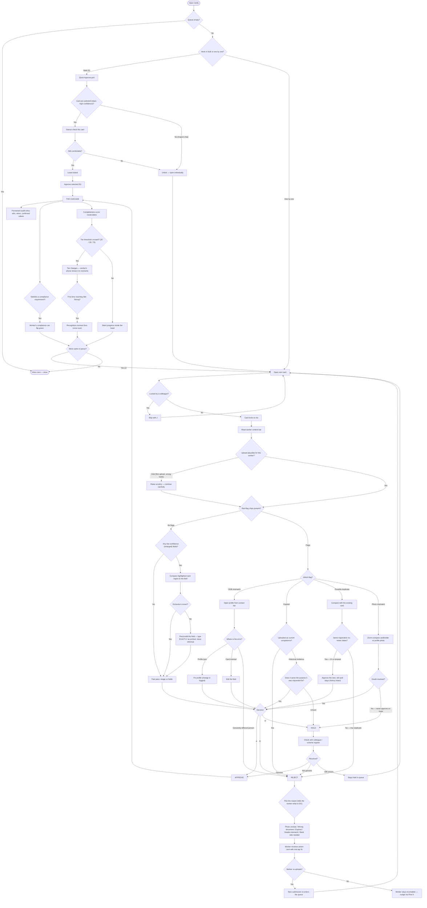

# 6. Verifying documents

This chapter covers the core recruiter job: reviewing the documents workers upload and deciding whether to trust them. Verification is what turns an uploaded photo into a credential the whole platform can rely on — worker tiers, compliance statuses and reports all build on the decisions you make here.

**Your role in one sentence:** the system reads each card for you; you judge whether it read it correctly and whether the card itself is genuine and current. You are *adjudicating*, not re-typing.

---

## 6.1 How the verification queue works

Every document a worker uploads lands in the **verification queue**, reached from **Verify** in the left sidebar. The badge on the sidebar item shows how many documents are waiting.

The queue is finite and ordered — the top bar shows your position ("Card 3 of 23 · 20 remaining") and a progress bar, so a review session has a clear end. Documents wait in the queue until a recruiter approves or rejects them; while a document is unverified, it earns the worker nothing.

ch06-queue-overview.png — capture pending; hotspots below are already live

<button class="hs" style="left:4%;top:20%" data-note="The Verify item in the sidebar carries a badge showing how many documents are waiting.">1</button>
<button class="hs" style="left:40%;top:8%" data-note="Your position in the queue — 'Card 3 of 23 · 20 remaining'. A review session has a visible end.">2</button>
<button class="hs" style="left:75%;top:8%" data-note="The progress bar fills as you clear the queue.">3</button>

<!-- When ch06-queue-overview.png is captured: replace the shot-canvas div with , then nudge each button's left/top percentages onto the real UI elements. -->

While you have a card open, it is locked to you — colleagues see it as in review and cannot act on it at the same time.

---

## 6.2 Reviewing a single card

Opening a card from the queue shows the review screen. Read it in this order:

**① The worker context bar (top).** Who uploaded this: photo, name, trade, time on platform, tier, how many other cards they hold, current project, and when they were last active. This is your plausibility check — a scaffolder uploading a scaffolding card with three other verified cards reads very differently from a brand-new account's first upload.

**② The red-flag bar.** If the system found anomalies, they appear here as chips — for example **DOB mismatch** (date on card differs from the profile), **Expired**, **Possible duplicate**, or **Photo mismatch**. **No red-flag bar means the system found nothing wrong** — that absence is itself information: clean cards deserve a faster pass.

**③ The card image (left).** Zoom, rotate, and open fullscreen. When the system is unsure about a specific area of the card, that region is highlighted so you can compare it against the extracted value directly.

**④ The extracted fields (right).** The system reads every field off the card and shows its confidence visually: fields it is sure about appear small and dimmed; **fields it is unsure about appear enlarged with a coloured background** and a label such as CONFLICT or EXPIRED. Give your attention where the screen puts it — the big fields are the ones that need your eyes.

ch06-single-review.png — capture pending; tap the numbers

<button class="hs" style="left:45%;top:6%" data-note="Worker context bar: who uploaded this, their tier, other cards, project, and activity — your plausibility check.">1</button>
<button class="hs" style="left:45%;top:18%" data-note="Red-flag chips. No bar at all means the system found nothing wrong — clean cards deserve a faster pass.">2</button>
<button class="hs" style="left:20%;top:55%" data-note="The card image with the uncertain region highlighted — compare it against the extracted value beside it.">3</button>
<button class="hs" style="left:75%;top:55%" data-note="Extracted fields sized by confidence: dimmed = trust it, enlarged with colour = look at it.">4</button>

### Correcting a field

If the system read a field wrongly:

1. Click the pencil icon on the field.
2. Type the correct value exactly as printed on the card — including punctuation and format (a registration number like `D/618/4129` is entered with its slashes, never reformatted).
3. Click away to save.

Your correction is part of the approval — approving a card confirms the fields as shown, including your edits. Corrections also teach the system: consistently corrected patterns improve future extractions.

---

## 6.3 Approve, hold or reject

Three actions, three keyboard keys:

| Action | Key | When to use it | What happens next |
|---|---|---|---|
| **Approve** | ++a++ | The card is genuine, current, and every field is correct (after your edits) | Card becomes **verified** — it starts counting toward the worker's tier and compliance. The worker sees it as confirmed. |
| **Hold** | ++h++ | You need something before deciding — a colleague's opinion, a check with the worker | Card stays in the queue marked held; nothing changes for the worker yet. |
| **Reject** | ++r++ | The card is unreadable, wrong, expired beyond use, or not what it claims to be | You choose a **reason**; the worker is told in plain words what was wrong and how to fix it. The card never counts. |

Move between cards with ++j++ (next) and ++k++ (previous); press ++g++ for the grid view (section 6.5).

!!! warning "Approving is a compliance act"
    Every approval is recorded permanently in the audit trail — who approved, when, and the field values confirmed. If a client or regulator later asks "how did you know this worker held a valid CSCS on this date?", your approval is the answer. Approve only what you have actually looked at.

### Rejection reasons

Choose the reason that tells the worker what to *do*, not just what was wrong:

| Reason | The worker is told |
|---|---|
| Photo unclear | "The photo wasn't clear enough to read. Try again in better light, flat on a table." |
| Wrong document | "This doesn't look like the card we asked for — check and upload the right one." |
| Card expired | "This card has run out. Renew it and upload the new one." |
| Details don't match | "Some details on the card don't match your profile — check both and resend." |
| Back side needed | "We need the back of the card too — upload both sides." |

---

## 6.4 The verification loop — what the worker sees

Verification is a loop between two screens: the worker's phone and your dashboard.

<figure markdown>
<svg width="100%" viewBox="0 0 680 320" xmlns="http://www.w3.org/2000/svg" role="img" aria-label="Verification loop: worker uploads, AI reads, recruiter reviews, approve or reject; reject loops back through fix and resend">
<defs><marker id="arr6" viewBox="0 0 10 10" refX="8" refY="5" markerWidth="6" markerHeight="6" orient="auto-start-reverse"><path d="M2 1L8 5L2 9" fill="none" stroke="#5F5E5A" stroke-width="1.5" stroke-linecap="round" stroke-linejoin="round"/></marker></defs>
<text x="44" y="44" font-size="14" font-weight="500" fill="#444441" font-family="sans-serif">Worker's phone — TAG Connect</text>
<rect x="40" y="56" width="600" height="84" rx="8" fill="none" stroke="#B4B2A9" stroke-width="1" stroke-dasharray="4 4"/>
<text x="44" y="190" font-size="14" font-weight="500" fill="#444441" font-family="sans-serif">Recruiter dashboard</text>
<rect x="40" y="200" width="600" height="84" rx="8" fill="none" stroke="#B4B2A9" stroke-width="1" stroke-dasharray="4 4"/>
<rect x="50" y="78" width="160" height="44" rx="8" fill="#F1EFE8" stroke="#5F5E5A" stroke-width="0.5"/>
<text x="130" y="100" font-size="14" font-weight="500" fill="#2C2C2A" text-anchor="middle" dominant-baseline="central" font-family="sans-serif">Upload card photo</text>
<a href="#rejection-reasons"><rect x="270" y="78" width="150" height="44" rx="8" fill="#FAEEDA" stroke="#854F0B" stroke-width="0.5"/>
<text x="345" y="100" font-size="14" font-weight="500" fill="#633806" text-anchor="middle" dominant-baseline="central" font-family="sans-serif">Fix and resend</text></a>
<rect x="470" y="78" width="150" height="44" rx="8" fill="#E1F5EE" stroke="#0F6E56" stroke-width="0.5"/>
<text x="545" y="100" font-size="14" font-weight="500" fill="#04342C" text-anchor="middle" dominant-baseline="central" font-family="sans-serif">Card verified</text>
<rect x="50" y="224" width="160" height="44" rx="8" fill="#F1EFE8" stroke="#5F5E5A" stroke-width="0.5"/>
<text x="130" y="246" font-size="14" font-weight="500" fill="#2C2C2A" text-anchor="middle" dominant-baseline="central" font-family="sans-serif">AI reads the card</text>
<a href="#62-reviewing-a-single-card"><rect x="270" y="224" width="160" height="44" rx="8" fill="#E6F1FB" stroke="#185FA5" stroke-width="0.5"/>
<text x="350" y="246" font-size="14" font-weight="500" fill="#0C447C" text-anchor="middle" dominant-baseline="central" font-family="sans-serif">Recruiter reviews</text></a>
<a href="#63-approve-hold-or-reject"><rect x="470" y="224" width="160" height="44" rx="8" fill="#E6F1FB" stroke="#185FA5" stroke-width="0.5"/>
<text x="550" y="246" font-size="14" font-weight="500" fill="#0C447C" text-anchor="middle" dominant-baseline="central" font-family="sans-serif">Approve or reject</text></a>
<line x1="130" y1="122" x2="130" y2="220" stroke="#5F5E5A" stroke-width="1.5" marker-end="url(#arr6)"/>
<line x1="210" y1="246" x2="266" y2="246" stroke="#5F5E5A" stroke-width="1.5" marker-end="url(#arr6)"/>
<line x1="430" y1="246" x2="466" y2="246" stroke="#5F5E5A" stroke-width="1.5" marker-end="url(#arr6)"/>
<line x1="550" y1="224" x2="550" y2="126" stroke="#5F5E5A" stroke-width="1.5" marker-end="url(#arr6)"/>
<text x="558" y="176" font-size="12" fill="#5F5E5A" font-family="sans-serif">approve</text>
<path d="M500 224 L500 170 L385 170 L385 126" fill="none" stroke="#5F5E5A" stroke-width="1.5" marker-end="url(#arr6)"/>
<text x="492" y="192" font-size="12" fill="#5F5E5A" text-anchor="end" font-family="sans-serif">reject</text>
<path d="M305 122 L305 220" fill="none" stroke="#5F5E5A" stroke-width="1.5" marker-end="url(#arr6)"/>
<text x="297" y="176" font-size="12" fill="#5F5E5A" text-anchor="end" font-family="sans-serif">resend</text>
</svg>
<figcaption>Boxes are clickable — jump straight to that step. Approving ends the loop; rejecting sends the worker a plain-words fix and the resent card returns to your queue.</figcaption>
</figure>

While the card sits in your queue, the worker's app shows **"being checked — nothing more for you to do"**. Queue speed is therefore worker experience: a new worker stays at the New Hand tier until their first document is verified, so a queue that turns around within a day keeps onboarding feeling fast.

### Requesting a re-upload

Rejecting with a reason automatically asks the worker to re-upload. To request a re-upload from elsewhere (a worker profile, or a card verified earlier that now needs a better image), use **Request re-upload** on the card — the worker gets the same plain-words message, and the new submission comes back through the queue.

---

## 6.5 Quick Approve — clearing clean cards in bulk

Press **G** or choose the grid view. Quick Approve shows only cards the system is highly confident about with **no anomalies found**:

1. Clean cards appear **pre-selected** with a green ring.
2. Any card with a doubt appears **unselected** with an orange **Inspect** chip — click it to open the full single-card review.
3. Glance over the selected cards, untick any you want to look at properly, and click **Approve selected (N)**.

There is deliberately no "approve all" and no bulk reject — every approval, even in bulk, is a per-card decision you have visibly confirmed.

SCREENSHOT ch06-quick-approve.png — grid with pre-selected clean cards and one Inspect-flagged card; callouts: ① green ring ② Inspect chip ③ Approve selected button

---

## 6.6 Uploading a card on a worker's behalf

When a worker hands you a physical card or emails a photo, you can upload it for them: from the worker's profile choose **Upload on behalf**, photograph or attach the image, and confirm. Values the system extracts are shown with a **VERBATIM** badge; anything you type by hand is marked **ENTERED** — the difference is recorded, and the card then joins the verification queue like any other upload (a second person approves it; you can't approve your own manual entry).

---

## 6.10 Keyboard shortcuts

| Key | Action |
|---|---|
| ++a++ | Approve the open card |
| ++h++ | Hold |
| ++r++ | Reject (opens reason picker) |
| ++j++ / ++k++ | Next / previous card |
| ++g++ | Grid (Quick Approve) view |

---

## 6.7 What approving actually triggers

An approval is never just a green tick — it cascades:

1. The card becomes the worker's **verified evidence** for any requirement it satisfies — their compliance status can flip green off the back of it.
2. Their **completeness score recalculates**, and if a threshold is crossed, their **tier changes** — the worker's phone shows the promotion moments later. For a new worker, your first approval is literally the event that lifts them out of New Hand.
3. A permanent **audit entry** records you, the timestamp, and the confirmed field values.

Rejection cascades too: the worker gets the plain-words reason as an action card, the document counts for nothing, and the same permanent record is written. Understanding the cascade is why queue speed matters — every card sitting unreviewed is a worker whose tier, compliance, and deployability are frozen.

## 6.8 The red-flag glossary

| Chip | What triggered it | How to judge it |
|---|---|---|
| **DOB mismatch** | Date of birth read from the card differs from the worker's profile | Open the profile from the context bar. Typo on one side → correct it (the fix is logged); genuinely different person's card → reject: *details don't match* |
| **Expired** | The card's expiry date has passed | Usually reject: *card expired*. Exception — a card uploaded as historical evidence rather than current competence: judge against why it was requested |
| **Possible duplicate** | A very similar card already exists for this worker | Compare the two: a renewal (newer dates, same registration number) is legitimate — approve the new; a genuine double-submission → reject the duplicate |
| **Photo mismatch** | The cardholder photo doesn't resemble the profile photo | The serious one. Compare carefully at zoom; unresolved doubt → **Hold** and raise it, don't approve on hope |

## 6.9 Edge cases & judgment calls

**Two cards of the same type.** Normal and fine — a worker with an expired CSCS *and* its valid renewal is exactly what renewal looks like. The platform judges by the **valid** one; you don't need to delete the old card, and its history stays in the trail.

**The card is genuine but the details are stale** (old address, name changed since marriage). Verify what the card attests — its qualification and validity. Profile details are corrected on the profile, not by rejecting a real card.

**You can read the card but the system barely could** (worn card, odd variant). Correct every field yourself against the image and approve — your eyes outrank the extraction, and your corrections teach it.

**You're not sure the card type is what it claims.** Unfamiliar scheme, odd layout — **Hold** and check with a colleague or the scheme's own register. An approval you couldn't defend later is worse than a day's delay.

**The worker is standing next to you asking you to hurry.** The queue doesn't know about social pressure, and neither should your judgment. The standard is the same whether the worker is watching or not — that consistency *is* what your approvals are worth.

**You realise a past approval was wrong.** It can't be unhappened — the trail is honest — but it can be corrected: request a re-review/re-upload, reject properly this time, and the record shows both the error and the fix. A visible correction is a *good* audit story; a quiet one isn't possible, by design.

---

## The whole chapter as one flow

Everything above, drawn as a single decision map — queue mechanics, all four red-flag trees, the three-way decision, and the approval cascade. When in doubt mid-review, find your position on this map:

*This diagram also lives in the [product flow maps](16-flow-maps.md) with its six siblings.*

## Troubleshooting this chapter

| You see | It means | Do this |
|---|---|---|
| A card you approved shows "Approved" but reappears | The save didn't complete (rare) | Reopen the card and check its status before re-approving |
| A card is locked and you can't open it | A colleague has it open | Move on with J; it unlocks when they finish |
| Fields all look correct but a red flag shows | The flag concerns cross-checks (e.g. profile DOB), not the card text | Open the worker's profile from the context bar and compare |
| A worker says "my card vanished" | It was rejected and awaits re-upload | Check the worker's cards for the rejected status and reason |

Was this page helpful? [Tell us what was missing](mailto:support@tagconstructionltd.co.uk?subject=Help%20centre%20feedback%3A%20Verifying%20documents) — feedback shapes the next update.

