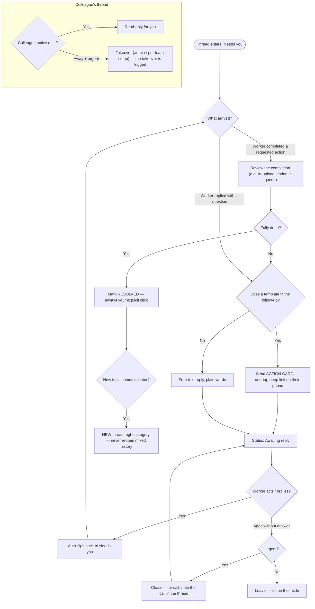

# 7. Messaging workers

Messaging in TAG is built around a simple observation: most recruiter–worker conversations aren't chat — they're **actions**. "Re-upload this card." "Confirm your date of birth." "Your CSCS expires Friday." The messaging system treats these as structured actions with buttons on the worker's side, and keeps free-text chat for everything else.

## 7.1 Two places, one inbox

- **The chat dock** — bottom corner, on every page. A collapsed pill with your unread count; click to open the inbox list; click a thread to chat in a floating window without leaving what you were doing. Built for quick replies mid-task.
- **The Messages page** — the full workspace: inbox on the left, conversation in the middle, and a **worker context panel** on the right (their tier, project, compliance, cards, links to profile and audit trail) so you never answer blind. Built for working the queue properly.

SCREENSHOT ch07-messages-page.png — three-pane Messages page; callouts: ① status chips ② category dots ③ context strip on an action thread ④ worker context panel

## 7.2 Statuses — whose move is it?

Every thread carries one status, and it answers one question: who acts next?

| Status | Meaning | Your move |
|---|---|---|
| **Needs you** (red) | The worker replied or completed something — the ball is yours | Respond or resolve |
| **Awaiting reply** (amber) | You've asked; the worker hasn't answered yet | None — chase only if it ages |
| **Resolved** (green) | Done and closed | None |

Filter the inbox by status; **Needs you is your work queue**. When a worker completes a requested action (say, re-uploads the card), the thread flips to Needs you automatically — completion is the worker's reply. Resolving is always your explicit click, so nothing closes itself quietly.

## 7.3 Categories

Threads are categorised — card verification, compliance, profile, project, general — each with its colour dot in the inbox. Filter by category when you're in a mode: clearing all card-verification threads before lunch beats ping-ponging between topics.

## 7.4 Action messages vs free text

The composer offers **template chips** for the common asks: *Photo unclear · Need the back side · Confirm DOB · Card expired · Missing RTW…* Sending one doesn't send a text bubble — it sends the worker an **action card**: a highlighted card on their phone with one big button that deep-links them into exactly the right screen (the re-upload flow for that specific card, for instance).

Use the template whenever one fits — the worker's completion rate is dramatically better when the fix is one tap away rather than described in prose. Free text is for everything the templates don't cover.

On your side, action threads show a **context strip** at the top — "About: CPCS card A59 — re-upload requested · Open card →" — so the thread and the record it concerns are always one click apart.

## 7.5 Etiquette that keeps the system honest

- **Resolve threads when they're done.** Open threads are the team's shared picture of outstanding work; a finished-but-open thread is noise for everyone.
- **One topic per thread.** A new issue deserves a new thread with the right category — mixed threads become unfindable later.
- **Chat isn't the audit trail.** Decisions and document actions are recorded in the audit trail automatically; don't rely on chat history as your compliance record.

## 7.6 Colleague threads and takeover

While a colleague is actively working a thread, it's marked as theirs — you can read it but not talk over them. If they're away and something's urgent, **takeover** (admins, or per your team's setup) reassigns it to you — and yes, the takeover itself is logged.

## The thread lifecycle — one map

Whose move is it, at every point in a thread's life:

*This diagram also lives in the [product flow maps](16-flow-maps.md) with its six siblings.*

## Troubleshooting this chapter

| You see | It means | Do this |
|---|---|---|
| Worker says they replied; thread still shows Awaiting | They may have replied in a different thread | Check their other threads via the context panel |
| Your action template didn't attach the right card | The thread wasn't opened from that card | Start the request from the card itself (profile → card tile → Request re-upload) |
| Unread badge won't clear | An old thread deep in a category filter | Clear filters, sort by unread |

Was this page helpful? [Tell us what was missing](mailto:support@tagconstructionltd.co.uk?subject=Help%20centre%20feedback%3A%20Messaging).

