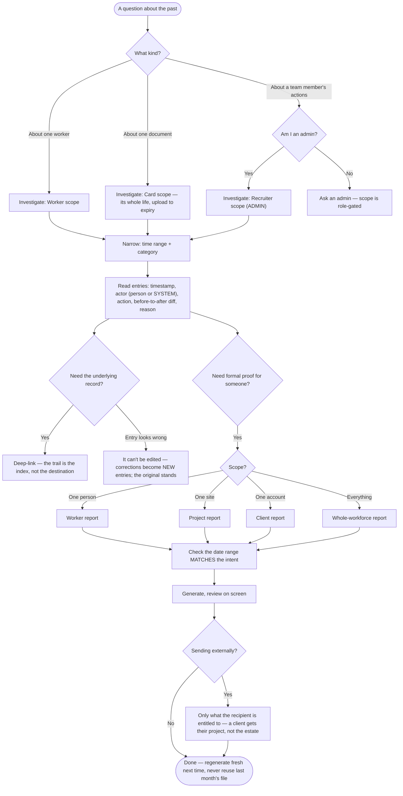

# 10. The audit trail

The audit trail is the platform's permanent memory: for any record, at any time, it answers **what happened, when, who did it, and why**. It looks like the least exciting page in the dashboard; it is the one that wins disputes.

## 10.1 When you'll actually need it

- **A client or regulator asks** "how did you know this worker held a valid CSCS on 28 May?" — the trail shows the card, who verified it, when, and against what evidence.
- **A worker disputes a rejection** — "you rejected my card unfairly." The entry shows the reviewer, the timestamp, and the stated reason.
- **A record looks wrong** — a name changed, a card vanished. The trail shows every edit as **before → after**, with the editor's name.
- **Reconstructing history** — what happened to this worker between March and May? Read it in order.

## 10.2 Anatomy of an entry

Every entry carries: the **timestamp** (server-recorded — not editable by anyone) · the **actor** and their type (a recruiter by name, the worker, or *system* for automatic actions like the nightly expiry check) · the **action** and its **target** · for edits, the **before → after diff** ("John Smith" → "John Smyth") · the **reason** where one exists (rejection reasons, for instance) · and a **deep-link** to the record itself.

That last one is the intended way to use the page: **the trail is the index, not the destination**. Spot the entry that matters, click through to the actual card, profile or thread.

SCREENSHOT ch10-entry-anatomy.png — one expanded entry; callouts: ① timestamp ② actor ③ before→after diff ④ deep-link

## 10.3 Investigating

The **Investigate** panel scopes the trail to one entity:

| Scope | Shows | Who can use it |
|---|---|---|
| **Worker** | Everything involving one worker — uploads, verifications, edits, tier changes, placements | All recruiters |
| **Card** | One document's whole life: uploaded → read → reviewed → verified/rejected → edits → expiry | All recruiters |
| **Recruiter** | Everything one team member did — "what did Marcus action this week?" | **Admins only** (marked with the ADMIN badge) |

Then narrow with the **time-range** chips (all time / 7 days / 30 days) and **category** filters. The worker's profile also carries its own audit section — same data, handier when you're already on the profile.

## 10.4 Reading system entries

Not every actor is a person. Entries attributed to **system** are the platform doing its scheduled work — the nightly expiry sweep recalculating a worker after a card lapsed, a tier change firing from a verification. A demotion with actor *system* and cause *card expired* is the complete explanation of "why did Dharminder drop a tier overnight?" — no human did it, arithmetic did.

## 10.5 The rules that make it trustworthy

- **Entries are immutable.** Append-only — no edit, no delete, not by admins, not by anyone. If something was recorded wrongly, the *correction* becomes a new entry; the original stands. This is precisely why the trail is evidence.
- **History outlives records.** A deleted card's entries remain; the trail is the account of what happened, and deleting a thing doesn't unhappen it.
- **Looking is logged.** Viewing a worker's audit trail is itself an audited event. The trail contains the history of personal data (old addresses, previous document details), so access to it is part of the record. Nothing to worry about in normal work — just know the mirror faces both ways.
- **Retention is long by design** — active entries are kept for years and archived beyond that, matching the timescales on which employment and compliance disputes actually arrive.

## 10.6 What's deliberately NOT in the trail

Chat message contents (conversations live in Messages — the trail records actions, not talk), page views and searches (noise, and a privacy problem), and anything with no compliance meaning. If you can't find "an entry for a message someone sent" — that's by design, look in the thread.

## 10.7 A worked example — the dispute

Kasia Nowak disputes that her CPCS card was unfairly rejected in June. Open **Investigate → Card**, select the CPCS card, range: all time. You read, in order: uploaded 3 June (actor: worker) → reviewed 4 June (actor: Marcus Hale) → **rejected, reason: photo unclear** → re-uploaded 6 June → verified 6 June (actor: Priya Shah). Total time to a complete, timestamped, named answer: under a minute. That's the page's whole value, compressed.

## Investigation to evidence — one map

From "a question about the past" to a report in someone's hands, including the admin gate and the external-sharing check:

*This diagram also lives in the [product flow maps](16-flow-maps.md) with its six siblings.*

Was this page helpful? [Tell us what was missing](mailto:support@tagconstructionltd.co.uk?subject=Help%20centre%20feedback%3A%20Audit%20trail).

