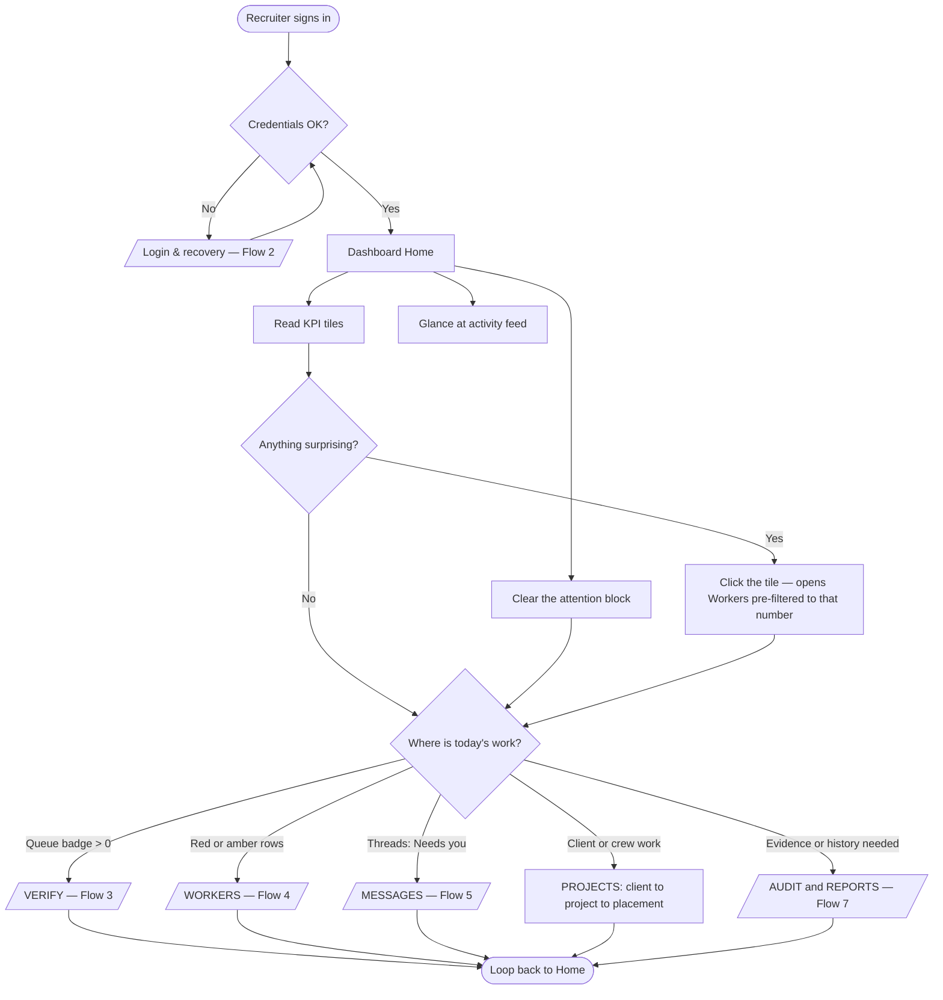
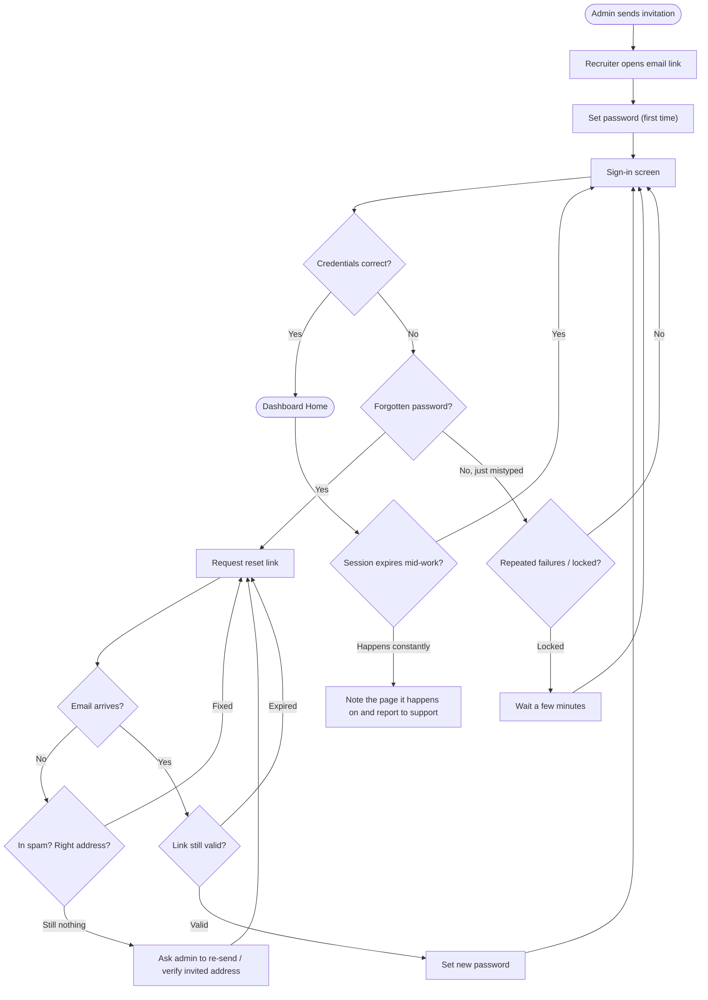
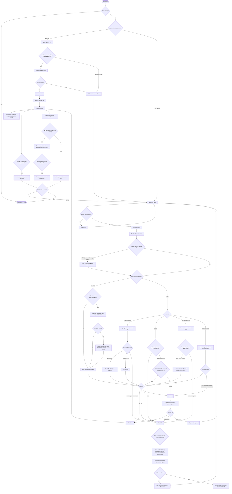
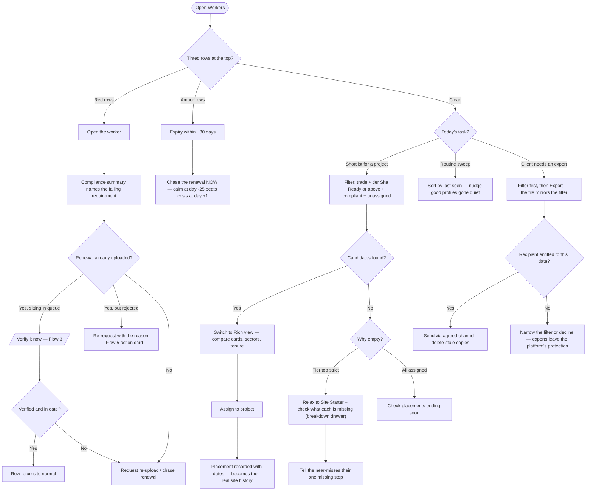
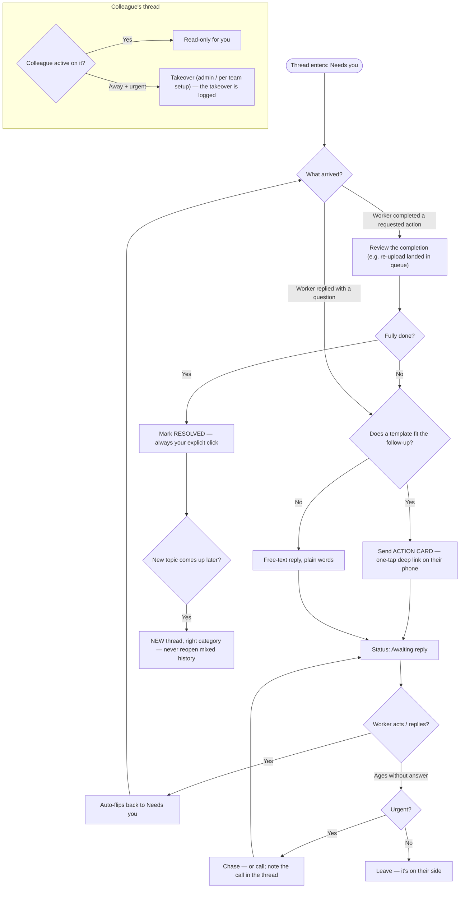
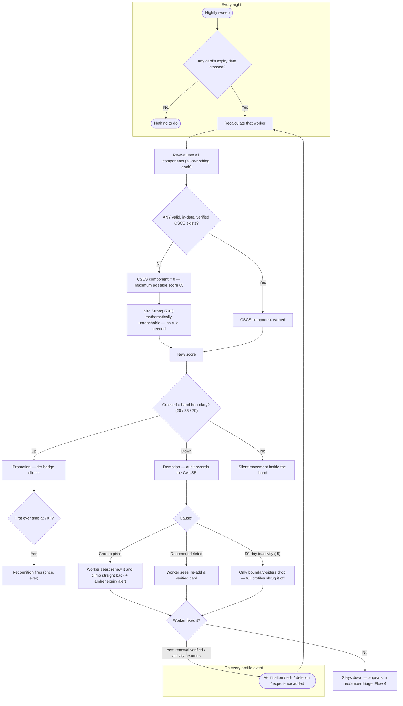
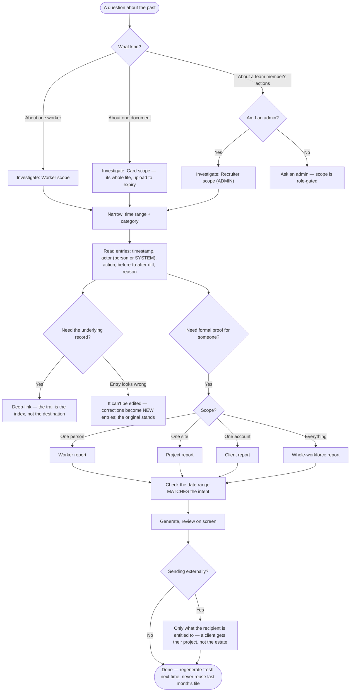

# Product flow maps

The complete decision logic of the recruiter dashboard, drawn: one master map plus six detailed flows, nested down to individual judgment calls. Rectangles are actions, diamonds are decisions, edge labels are the answers. Each flow summarises a chapter of this manual — use these as the visual index, and the chapters for the words. Each flow is also embedded in its home chapter, right where you need it.

!!! note "One global rule, drawn nowhere"
    Every human action in these flows writes a permanent audit entry — who, when, what. Repeating that on every node would double the diagrams, so it's stated once here and holds everywhere.

## 1 · Master map — how the whole dashboard hangs together

The top-level journey: sign in, triage from Home, branch into one of the five working areas. Each grey subflow node expands in its own numbered diagram below.

## 2 · Login & session

Access is invitation-only; every path back into the dashboard runs through here.

## 3 · Verification — the deep flow

The core loop of the product, nested to the judgment level: queue mechanics, then the four red-flag trees, then the decision, then everything an approval cascades into. This diagram and Flow 6 share the tier arithmetic.

!!! info "Judgment rules encoded above"
    a real card with stale personal details gets the profile fixed, not the card rejected · a worker standing next to you changes nothing · a wrong past approval is corrected visibly (re-review + proper rejection), never quietly.

## 4 · Worker triage & placement

The daily table routine — colours first, then the two jobs: fixing red, and shortlisting for placement.

## 5 · Messaging lifecycle

Every thread answers one question — whose move is it? — and the statuses enforce it.

## 6 · The automatic engines — what the system does without you

The flows that run on their own: the nightly expiry sweep, the score recalculation, and the tier arithmetic — including the CSCS cap, which is arithmetic, not a rule.

## 7 · Audit & reporting

The evidence layer: investigating history, and producing the formal proof.

!!! info "Global properties"
    every human action in Flows 3–5 writes an immutable audit entry · viewing an audit trail is itself logged · deleting a record never deletes its history.

Was this page helpful? [Tell us what was missing](mailto:support@tagconstructionltd.co.uk?subject=Help%20centre%20feedback%3A%20Flow%20maps).

